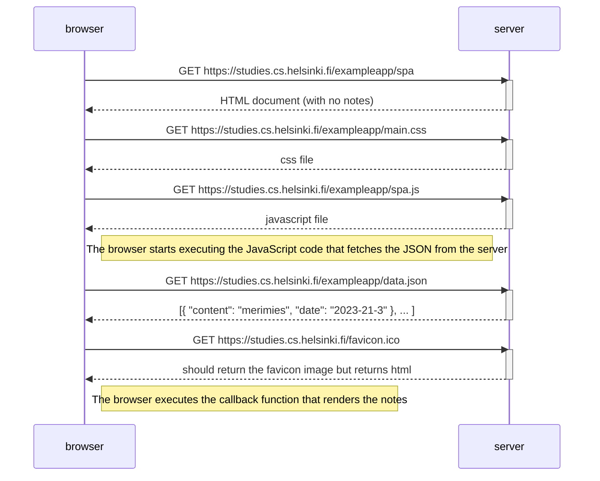

```mermaid

sequenceDiagram
    participant browser
    participant server
    
    browser->>server: GET  https://studies.cs.helsinki.fi/exampleapp/spa
    activate server
    server-->>browser: HTML document (with no notes)
    deactivate server

    browser->>server: GET  https://studies.cs.helsinki.fi/exampleapp/main.css
    activate server
    server-->>browser: css file
    deactivate server

    browser->>server: GET  https://studies.cs.helsinki.fi/exampleapp/spa.js
    activate server
    server-->>browser: javascript file
    deactivate server
    
    Note right of browser: The browser starts executing the JavaScript code that fetches the JSON from the server
    
    browser->>server: GET https://studies.cs.helsinki.fi/exampleapp/data.json
    activate server
    server-->>browser: [{ "content": "merimies", "date": "2023-21-3" }, ... ]
    deactivate server     

    browser->>server: GET https://studies.cs.helsinki.fi/favicon.ico
    activate server
    server-->>browser: should return the favicon image but returns html
    deactivate server   

    Note right of browser: The browser executes the callback function that renders the notes 
    
```