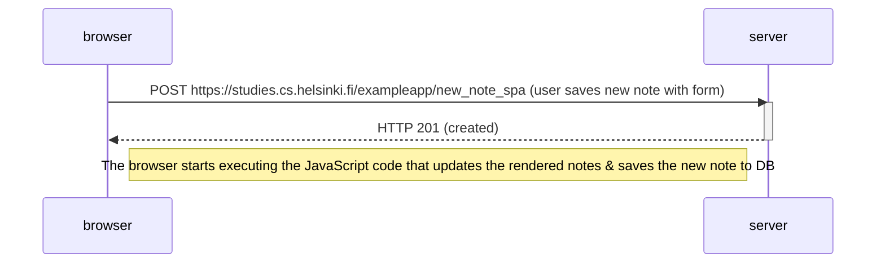

```mermaid

sequenceDiagram
    participant browser
    participant server
    
    browser->>server: POST https://studies.cs.helsinki.fi/exampleapp/new_note_spa (user saves new note with form)
    activate server
    server-->>browser: HTTP 201 (created)
    deactivate server
    
    Note right of browser: The browser starts executing the JavaScript code that updates the rendered notes & saves the new note to DB  
    
```